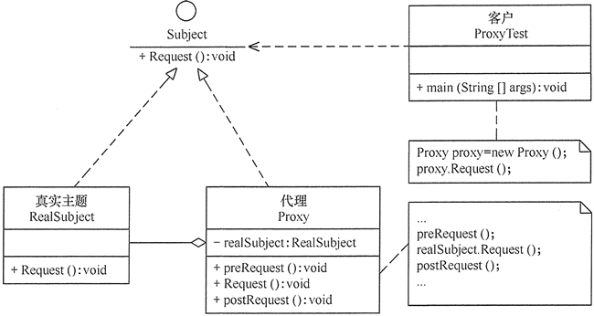

## 结构型模式

结构型模式描述如何将类或对象按照某种布局组成更大的结构

* 代理模式：为某种对象提供一个代理以控制对象的访问
* 适配器模式：将一个类的接口转换成客户希望的另一个接口，使得原本由于接口不兼容而不能一起工作的那些类一起工作
* 桥接模式：将抽象与现实分离，使他们可以单独进行变换
* 装饰模式：动态的给对象增加一些职责
* 外观模式：对多个复杂的子系统提供一个一致的接口
* 享元模式：运用共享技术来有效地支持大量细粒度对象复用
* 组合模式：将对象组合成树状层次结构，使用户对单个对象和组合对象具有一致的访问性

### 1.代理模式


<b>代理模式主要角色</b>

1. 抽象主题类：通过接口或抽象类声明正式主题和代理对象实现的业务方法
2. 真实主题类：实现抽象主题类中的具体业务，是代理对象所代表的的真实对象
3. 代理类：提供与真实主题相同的接口，内部包含对真实主题的引用



<b>代理模式的实现</b>

```
public class Porxy {
    interface Subject{
        void show();
    }

    class RealizeSubject implements Subject{
        @Override
        public void show() {
            System.out.println("现实主题展示");
        }
    }

    class SubjectProxy implements Subject{
        RealizeSubject rSubject;
        public SubjectProxy(){
            if(rSubject==null){
                rSubject=new RealizeSubject();
            }
        }
        @Override
        public void show() {
            System.out.println("代理类展示前");
            rSubject.show();
            System.out.println("代理类展示后");
        }
    }

}
```

<b>代理模式适用场景</b>

* 远程代理，通常为了隐藏目标对象存在于不同地址空间的事实，方便客户端访问
* 虚拟代理，通常用于要创建的目标对象开销很大
* 安全代理，控制不同权限的客户对真实对象的访问
* 智能指引，用于调用目标对象时，代理附加一些额外的处理功能
* 延迟加载，为了提高系统的性能，延迟对目标的加载

### 2.适配器模式

<b>适配器模式包含的角色</b>

* 目标接口:当前系统业务所期待的接口
* 适配者类：是被访问和适配的现存组件库中的组件接口
* 适配器类：是一个转换器，通过继承或引用适配者的对象，把适配者接口转化成目标接口

类适配器模式


对象适配器模式


<b>适配器模式的实现</b>

```
public class Adapter {

    interface Target{
        void show();
    }

    class Adaptee{
        public void specificShow(){
            System.out.println("适配者中的业务代码被调用");
        }
    }

    class MainAdapter extends Adaptee implements Target{

        @Override
        public void show() {
            specificShow();
        }
    }
}
```

<b>适配器模式适用场景</b>

* 以前开发的系统存在满足新系统需求的类，但其接口同新系统的接口不一致
* 使用第三方提供的组件，但组件接口定义和自己要求的接口定义不同

### 3.桥接模式

<b>桥接模式主要包含角色</b>

* 抽象化角色：定义抽象类，并包含一个对实现化对象的引用
* 扩展抽象化角色：是抽象化角色的子类，实现父类中的业务方法，并通过组合关系调用实现化角色中的业务方法
* 实现化角色：定义实现化角色的接口，供扩展抽象化角色调用
* 具体实现化角色:是实现化角色的具体实现


<b>桥接模式的实现</b>

```
public class Bridge {
    abstract class Abstraction {
        protected Implenmentor implenmentor;

        protected Abstraction(Implenmentor implenmentor) {
            this.implenmentor = implenmentor;
        }

        public abstract void show();
    }

    class ExtendAbstraction extends Abstraction {
        protected ExtendAbstraction(Implenmentor implenmentor) {
            super(implenmentor);
        }

        @Override
        public void show() {
            System.out.println("扩展抽象化角色调用");
            implenmentor.operation();
        }
    }

    interface Implenmentor {
        void operation();
    }

    class ImplenmentorA implements Implenmentor {

        @Override
        public void operation() {
            System.out.println("具体实现化被调用");
        }
    }
}
```

<b>桥接模式适用的场景</b>

* 当一个类存在两个独立变化的纬度，且这两个纬度都需要扩展时
* 当一个系统不希望使用继承或因为多层次继承导致系统类的个数增加
* 当一个系统需要在构件的抽象化角色和具体化角色之间增加更多的灵活性

### 4.装饰模式

<b>装饰模式主要的角色</b>

* 抽象构件角色：定一个抽象接口以规范准备接收附加责任的对象
* 具体构件角色：实现抽象构件角色，添加一些职责
* 抽象装饰角色：继承抽象构件，并包含具体构件的实例，通过其子类扩展具体构件的功能
* 具体装饰角色：实现抽象装饰的相关方法


<b>装饰模式的实现</b>

```
public class Decorate {
    interface House {
        void open();
    }

     class HouseImpl implements House {
        String t;

        @Override
        public void open() {
            System.out.println("房子里有:" + t);
        }

        public void setT(String t){
            this.t=t;
        }
    }

    class Thing implements House {
        House house;

        Thing(House house) {
            this.house = house;
        }


        @Override
        public void open() {
            house.open();
        }
    }

     class Table extends Thing {

        Table(House house) {
            super(house);
        }

        @Override
        public void open() {
            ((HouseImpl) house).setT("桌子");
            super.open();
        }
    }

     class Chair extends Thing {

        Chair(House house) {
            super(house);
        }

        @Override
        public void open() {
            ((HouseImpl) house).setT("椅子");
            super.open();
        }
    }
}
```

<b>装饰模式适用的场景</b>

* 当需要给一个现有类添加附加职责，而又不能采用生成子类的方法进行扩充时。例如，该类被隐藏或者该类是终极类或者采用继承方式会产生大量的子类。
* 当需要通过对现有的一组基本功能进行排列组合而产生非常多的功能时，采用继承关系很难实现，而采用装饰模式却很好实现。
* 当对象的功能要求可以动态地添加，也可以再动态地撤销时。

### 5.外观模式

<b>外观模式主要的角色</b>

* 外观角色：为多个子系统提供一个共同的接口
* 子系统角色：实现系统的部分功能
* 客户角色：通过外观角色访问各个子系统


<b>外观模式的实现</b>

```
public class Appearence {

    class Facade {
        SubSystem1 subSystem1;
        SubSystem2 subSystem2;
        SubSystem3 subSystem3;

        Facade() {
            subSystem1 = new SubSystem1();
            subSystem2 = new SubSystem2();
            subSystem3 = new SubSystem3();
        }

        public void method() {
            subSystem1.method1();
            subSystem2.method2();
            subSystem3.method3();
        }
    }

    class SubSystem1 {
        public void method1() {
            System.out.println("子系统1被调用");
        }
    }

    class SubSystem2 {
        public void method2() {
            System.out.println("子系统2被调用");
        }
    }

    class SubSystem3 {
        public void method3() {
            System.out.println("子系统3被调用");
        }
    }
}
```

<b>外观模式适用场景</b>

* 对分层结构系统构建时，使用外观模式定义子系统中每层的入口点可以简化子系统之间的依赖关系
* 当一个复杂系统的子系统很多时，外观模式可以为系统设计一个简单的接口供外界访问
* 当客户端与多个子系统之间存在很大的联系时，引入外观模式可将它们分离，从而提高子系统的独立性和可移植性

### 6.享元模式

<b>享元模式主要角色</b>

* 抽象享元角色：是所有具体享元角色的基类
* 具体享元角色：继承抽象享元角色
* 非享元角色：是不可以共享的外部状态，以参数的的形式注入具体享元的相关方法中
* 享元工厂角色：负责创建和管理享元角色


<b>享元模式的实现</b>

```
public class CommonShare {

    interface FlyWeight {
        void operation(UnsharedFlyWeight unsharedFlyWeight);
    }

    class UnsharedFlyWeight {
        private String text;

        UnsharedFlyWeight(String text) {
            this.text = text;
        }

        public String getText() {
            return text;
        }

        public void setText(String text) {
            this.text = text;
        }
    }

    class ShareFlyWeight implements FlyWeight {
        private String key;

        ShareFlyWeight(String key) {
            this.key = key;
            System.out.println("共享信息:" + key + "被创建");
        }

        @Override
        public void operation(UnsharedFlyWeight unsharedFlyWeight) {
            System.out.println("共享信息:" + key + "被调用");
            System.out.println("非共享信息:" + unsharedFlyWeight.getText());
        }
    }

    class FlyWeightFactory {
        private HashMap<String, FlyWeight> flyWeights = new HashMap<>();

        public FlyWeight getFlyWeight(String key) {
            FlyWeight flyWeight = flyWeights.get(key);
            if (flyWeight != null) {
                System.out.println("具体享元：" + key + "已被创建");
            } else {
                flyWeight = new ShareFlyWeight(key);
                flyWeights.put(key, flyWeight);
            }
            return flyWeight;
        }
    }
}
```

<b>享元模式适用场景</b>

* 系统中存在大量相同或相似的对象，这些对象耗费大量的内存资源
* 大部分的对象可以按照内部状态进行分组，且可将不同部分外部化，这样每一个组只需保存一个内部状态
* 由于享元模式需要额外维护一个保存享元的数据结构，所以应当在有足够多的享元实例时才值得使用享元模式

### 7.组合模式

<b>组合模式的主要角色</b>

* 抽象构件角色：为树叶构件和树枝构件声明公共接口，并实现它们的默认行为
* 树叶构件角色：是组合中的叶节点对象，它没有子节点，用于实现抽象构件角色中 声明的公共接口。
* 树枝构件角色：是组合中的分支节点对象，它有子节点。它实现了抽象构件角色中声明的接口，它的主要作用是存储和管理子部件，通常包含 Add()、Remove()、GetChild() 等方法。


<b>组合模式的实现</b>

```
public class CompositePattern {
    interface Component {
        void add(Component c);

        void remove(Component c);

        Component getChild(int i);

        void operation();
    }

    class Leaf implements Component {
        private String name;

        public Leaf(String name) {
            this.name = name;
        }

        public void add(Component c) {
        }

        public void remove(Component c) {
        }

        public Component getChild(int i) {
            return null;
        }

        public void operation() {
            System.out.println("树叶" + name + "：被访问！");
        }
    }

    class Composite implements Component {
        private ArrayList<Component> children = new ArrayList<Component>();

        public void add(Component c) {
            children.add(c);
        }

        public void remove(Component c) {
            children.remove(c);
        }

        public Component getChild(int i) {
            return children.get(i);
        }

        public void operation() {
            for (Object obj : children) {
                ((Component) obj).operation();
            }
        }
    }
}
```

<b>组合模式适用场景</b>

* 在需要表示一个对象整体与部分的层次结构的场合。
* 要求对用户隐藏组合对象与单个对象的不同，用户可以用统一的接口使用组合结构中的所有对象的场合。
