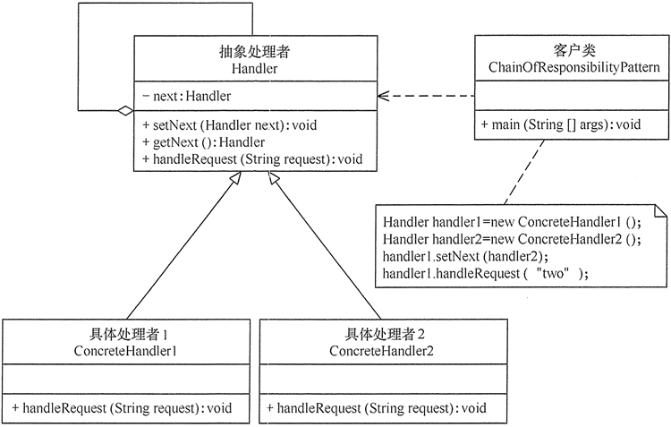

## 行为型模式

行为型模式用于描述程序在运行是复杂的流程控制，即描述多个类或对象之间怎样相互协作共同完成单个对象都无法单独完成的任务，它涉及算法域对象间职责的分配

* 模版方法模式：定义一个操作中的算法骨架，将算法的一些步骤延迟到子类中，让子类在不改变算法结构的情况下重定义算法
* 策略模式：定义一系列算法并将每个算法封装起来，是它们可以相互替换
* 命令模式：将一个请求封装为一个对象，是发出请求的责任和执行请求的责任分开
* 职责链模式：把请求从链中的一个对象传到下一个对象，直到请求被响应为止
* 状态模式：允许一个对象在其内部状态发生改变时改变其行为能力
* 观察者模式：多个对象间存在一对多关系，当一个对象发生改变时，把这种改变通知给其他多个对象
* 中介者模式：定义个中介对象来简化原有对象之间的交互关系，降低系统中对象间的耦合度
* 迭代器模式：提供一个方法来顺序访问聚合对象中的一系列数据，而不暴露聚合对象的内部表示
* 访问者模式：在不改变集合元素的前提下，为一个集合中的每个元素提供多种访问方式
* 备忘录模式：在不破坏封装性的前提下，获取并保存一个对象的内部状态，以便以后恢复它
* 解释器模式：提供如何定义语言的文法，以及对语言句子的解释方法

### 1.模版方法模式

<b>模版方法模式主要角色</b>

*抽象类

* 模版方法：定义了算法的框架，按照某种顺序调用基本方法
基本方法：
  1. 抽象方法
  2. 具体方法
  3. 钩子方法

* 具体子类：实现抽象类中所定义的抽象方法和钩子方法


<b>模版方法的实现</b>

```
//抽象类
abstract class AbstractClass
{
    public void TemplateMethod() //模板方法
    {
        SpecificMethod();
        abstractMethod1();          
         abstractMethod2();
    }  
    public void SpecificMethod() //具体方法
    {
        System.out.println("抽象类中的具体方法被调用...");
    }   
    public abstract void abstractMethod1(); //抽象方法1
    public abstract void abstractMethod2(); //抽象方法2
}
//具体子类
class ConcreteClass extends AbstractClass
{
    public void abstractMethod1()
    {
        System.out.println("抽象方法1的实现被调用...");
    }   
    public void abstractMethod2()
    {
        System.out.println("抽象方法2的实现被调用...");
    }
}
```

<b>模版方法模式适用场景</b>

* 算法的整体步骤固定，个别部分易变
* 当多个子类存在公共的行为时
* 当需要控制子类的扩展时

### 2.策略模式

<b>策略模式主要包含的角色</b>

* 抽象策略类：定义一个公共接口，各种不同的算法以不同的方式实现这个接口
* 具体策略类：实现抽象策略类接口，实现不同的算法
* 环境类：持有一个策略类的引用，供客户端调用


<b>策略模式实现</b>

```
//抽象策略类
interface Strategy
{   
    public void strategyMethod();    //策略方法
}
//具体策略类A
class ConcreteStrategyA implements Strategy
{
    public void strategyMethod()
    {
        System.out.println("具体策略A的策略方法被访问！");
    }
}
//具体策略类B
class ConcreteStrategyB implements Strategy
{
  public void strategyMethod()
  {
      System.out.println("具体策略B的策略方法被访问！");
  }
}
//环境类
class Context
{
    private Strategy strategy;
    public Strategy getStrategy()
    {
        return strategy;
    }
    public void setStrategy(Strategy strategy)
    {
        this.strategy=strategy;
    }
    public void strategyMethod()
    {
        strategy.strategyMethod();
    }
}
```

<b>策略模式适用场景</b>

* 一个系统需要动态地在几种算法中选择一种
* 一个类定义了多种行为
* 系统中各算法彼此完全独立，且要求对客户隐藏具体算法的实现细节
* 多个类只区别在表现行为不同

### 3.命令模式

<b>命令模式主要包含的角色</b>

* 抽象命令类：声明执行命令的接口
* 具体命令类：实现抽象命令类，拥有接受者对象
* 实现者/接受者：执行命令功能的相关操作
* 调用者/请求者：是请求的发送者


<b>命令模式的实现</b>

```
//调用者
class Invoker
{
    private Command command;
    public Invoker(Command command)
    {
        this.command=command;
    }
    public void setCommand(Command command)
    {
        this.command=command;
    }
    public void call()
    {
        System.out.println("调用者执行命令command...");
        command.execute();
    }
}
//抽象命令
interface Command
{
    public abstract void execute();
}
//具体命令
class ConcreteCommand implements Command
{
    private Receiver receiver;
    ConcreteCommand()
    {
        receiver=new Receiver();
    }
    public void execute()
    {
        receiver.action();
    }
}
//接收者
class Receiver
{
    public void action()
    {
        System.out.println("接收者的action()方法被调用...");
    }
}
```

<b>命令模式适用场景</b>

* 当系统需要将请求调用者与请求接收者解耦时，命令模式使得调用者和接收者不直接交互
* 当系统需要随机请求命令或经常增加或删除命令时，命令模式比较方便实现这些功能
* 当系统需要执行一组操作时，命令模式可以定义宏命令来实现该功能
* 当系统需要支持命令的撤销（Undo）操作和恢复（Redo）操作时，可以将命令对象存储起来，采用备忘录模式来实现

### 4.责任链模式

<b>责任链模式主要角色</b>

* 抽象处理者：定义个处理请求的接口，包括抽象处理方法和一个后继连接
* 具体处理者：实现抽象处理者的处理方法，判断能否处理本次请求
* 客户端角色：创建处理链，并向链头的具体处理者对象提交请求



<b>责任链模式的实现</b>

```
//抽象处理者角色
abstract class Handler
{
    private Handler next;
    public void setNext(Handler next)
    {
        this.next=next; 
    }
    public Handler getNext()
    { 
        return next; 
    }   
    //处理请求的方法
    public abstract void handleRequest(String request);       
}
//具体处理者角色1
class ConcreteHandler1 extends Handler
{
    public void handleRequest(String request)
    {
        if(request.equals("one")) 
        {
            System.out.println("具体处理者1负责处理该请求！");       
        }
        else
        {
            if(getNext()!=null) 
            {
                getNext().handleRequest(request);             
            }
            else
            {
                System.out.println("没有人处理该请求！");
            }
        } 
    } 
}
//具体处理者角色2
class ConcreteHandler2 extends Handler
{
    public void handleRequest(String request)
    {
        if(request.equals("two")) 
        {
            System.out.println("具体处理者2负责处理该请求！");       
        }
        else
        {
            if(getNext()!=null) 
            {
                getNext().handleRequest(request);             
            }
            else
            {
                System.out.println("没有人处理该请求！");
            }
        } 
    }
}
```

<b>责任链模式适用的场景</b>

* 有多个对象可以处理一个请求，哪个对象处理该请求由运行时刻自动确定
* 可动态指定一组对象处理请求，或添加新的处理者
* 在不明确指定请求处理者的情况下，向多个处理者中的一个提交请求

### 5.状态模式

<b>状态模式的主要角色</b>

* 环境角色：也称上下文，定义了客户感兴趣的接口，维护一个当前的状态，并将与状态相关的操作委托给当前状态对象来处理
* 抽象状态角色：定义个接口，用以封装环境对象中的特定状态所对应的行为
* 具体状态角色：实现抽象状态对应的行为


<b>状态模式的实现</b>

```
//环境类
class Context
{
    private State state;
    //定义环境类的初始状态
    public Context()
    {
        this.state=new ConcreteStateA();
    }
    //设置新状态
    public void setState(State state)
    {
        this.state=state;
    }
    //读取状态
    public State getState()
    {
        return(state);
    }
    //对请求做处理
    public void Handle()
    {
        state.Handle(this);
    }
}
//抽象状态类
abstract class State
{
    public abstract void Handle(Context context);
}
//具体状态A类
class ConcreteStateA extends State
{
    public void Handle(Context context)
    {
        System.out.println("当前状态是 A.");
        context.setState(new ConcreteStateB());
    }
}
//具体状态B类
class ConcreteStateB extends State
{
    public void Handle(Context context)
    {
        System.out.println("当前状态是 B.");
        context.setState(new ConcreteStateA());
    }
}
```

<b>状态模式使用场景</b>

* 当一个对象的行为取决于它的状态，并且它必须在运行时根据状态改变它的行为时，就可以考虑使用状态模式
* 一个操作中含有庞大的分支结构，并且这些分支决定于对象的状态时

### 6.观察者模式

<b>观察者模式主要角色</b>

* 抽象主题角色：提供一个用于保存观察者对象的聚集类和增加、删除观察者对象的方法、以及通知所有观察者的抽象方法
* 具体主题角色：实现抽象目标中的通知方法
* 抽象观察者角色：是一个抽象类或接口，包含一个更新自己的抽象方法
* 具体观察者角色：实现抽象观察者中定义的抽象方法


<b>观察者模式的实现</b>

```
/抽象目标
abstract class Subject
{
    protected List<Observer> observers=new ArrayList<Observer>();   
    //增加观察者方法
    public void add(Observer observer)
    {
        observers.add(observer);
    }    
    //删除观察者方法
    public void remove(Observer observer)
    {
        observers.remove(observer);
    }   
    public abstract void notifyObserver(); //通知观察者方法
}
//具体目标
class ConcreteSubject extends Subject
{
    public void notifyObserver()
    {
        System.out.println("具体目标发生改变...");
        System.out.println("--------------");       
       
        for(Object obs:observers)
        {
            ((Observer)obs).response();
        }
       
    }          
}
//抽象观察者
interface Observer
{
    void response(); //反应
}
//具体观察者1
class ConcreteObserver1 implements Observer
{
    public void response()
    {
        System.out.println("具体观察者1作出反应！");
    }
}
//具体观察者1
class ConcreteObserver2 implements Observer
{
    public void response()
    {
        System.out.println("具体观察者2作出反应！");
    }
}
```

<b>观察者模式适用场景</b>

* 对象间存在一对多关系，一个对象的状态发生改变会影响其他对象
* 当一个抽象模型有两个方面，其中一个方面依赖于另一方面时，可将这二者封装在独立的对象中以使它们可以各自独立地改变和复用

### 7.中介者模式

<b>终结者模式主要角色</b>

* 抽象中介者角色：定义个接口，提供了同时对象注册于转发同时对象信息的抽象方法
* 具体中介者角色：实现中介者接口，定义个List来管理同事对象，协调各个同事


<b>中介者模式的实现</b>

```
//抽象中介者
abstract class Mediator
{
    public abstract void register(Colleague colleague);
    public abstract void relay(Colleague cl); //转发
}
//具体中介者
class ConcreteMediator extends Mediator
{
    private List<Colleague> colleagues=new ArrayList<Colleague>();
    public void register(Colleague colleague)
    {
        if(!colleagues.contains(colleague))
        {
            colleagues.add(colleague);
            colleague.setMedium(this);
        }
    }
    public void relay(Colleague cl)
    {
        for(Colleague ob:colleagues)
        {
            if(!ob.equals(cl))
            {
                ((Colleague)ob).receive();
            }   
        }
    }
}
//抽象同事类
abstract class Colleague
{
    protected Mediator mediator;
    public void setMedium(Mediator mediator)
    {
        this.mediator=mediator;
    }   
    public abstract void receive();   
    public abstract void send();
}
//具体同事类
class ConcreteColleague1 extends Colleague
{
    public void receive()
    {
        System.out.println("具体同事类1收到请求。");
    }   
    public void send()
    {
        System.out.println("具体同事类1发出请求。");
        mediator.relay(this); //请中介者转发
    }
}
//具体同事类
class ConcreteColleague2 extends Colleague
{
    public void receive()
    {
        System.out.println("具体同事类2收到请求。");
    }   
    public void send()
    {
        System.out.println("具体同事类2发出请求。");
        mediator.relay(this); //请中介者转发
    }
}
```

<b>中介者模式适用场景</b>

* 当对象之间存在复杂的网状结构关系而导致依赖关系混乱且难以复用时
* 当想创建一个运行于多个类之间的对象，又不想生成新的子类时

### 8.迭代器模式

<b>迭代器模式主要角色</b>

* 抽象聚合角色：定义个存储、添加、删除聚合对象记忆创建迭代器对象的接口
* 具体聚合角色：实现抽象聚合类，返回一个具体迭代器的实例
* 抽象迭代器角色：定义访问和遍历聚合元素的接口
* 具体迭代器角色：实现抽象迭代器接口中定义的方法，完成对聚合对象的遍历，记录遍历的当前位置


<b>迭代器的实现</b>

```
//抽象聚合
interface Aggregate
{ 
    public void add(Object obj); 
    public void remove(Object obj); 
    public Iterator getIterator(); 
}
//具体聚合
class ConcreteAggregate implements Aggregate
{ 
    private List<Object> list=new ArrayList<Object>(); 
    public void add(Object obj)
    { 
        list.add(obj); 
    }
    public void remove(Object obj)
    { 
        list.remove(obj); 
    }
    public Iterator getIterator()
    { 
        return(new ConcreteIterator(list)); 
    }     
}
//抽象迭代器
interface Iterator
{
    Object first();
    Object next();
    boolean hasNext();
}
//具体迭代器
class ConcreteIterator implements Iterator
{ 
    private List<Object> list=null; 
    private int index=-1; 
    public ConcreteIterator(List<Object> list)
    { 
        this.list=list; 
    } 
    public boolean hasNext()
    { 
        if(index<list.size()-1)
        { 
            return true;
        }
        else
        {
            return false;
        }
    }
    public Object first()
    {
        index=0;
        Object obj=list.get(index);;
        return obj;
    }
    public Object next()
    { 
        Object obj=null; 
        if(this.hasNext())
        { 
            obj=list.get(++index); 
        } 
        return obj; 
    }   
}
```

<b>迭代器模式适用场景</b>

* 当需要为聚合对象提供多种遍历方式时
* 当需要为遍历不同的聚合结构提供一个统一的接口时
* 当访问一个聚合对象的内容而无须暴露其内部细节的表示时

### 9.访问者模式

<b>访问者模式主要角色</b>

* 抽象访问者角色：定义一个访问具体元素的接口，为每个具体元素类对应一个访问操作
* 具体访问者角色：实现抽象访问者角色中声明的各个访问操作，确定访问者访问一个元素时该做什么
* 抽象元素角色：声明一个包换接受操作的accept接口
* 具体元素角色：实现抽象元素角色
* 对象结构角色：是一个包换元素角色的容器，提供让访问者对象遍历容器中的所有元素方法


<b>访问者模式的实现</b>

```
//抽象访问者
interface Visitor
{
    void visit(ConcreteElementA element);
    void visit(ConcreteElementB element);
}
//具体访问者A类
class ConcreteVisitorA implements Visitor
{
    public void visit(ConcreteElementA element)
    {
        System.out.println("具体访问者A访问-->"+element.operationA());
    }
    public void visit(ConcreteElementB element)
    {
        System.out.println("具体访问者A访问-->"+element.operationB());
    }
}
//具体访问者B类
class ConcreteVisitorB implements Visitor
{
    public void visit(ConcreteElementA element)
    {
        System.out.println("具体访问者B访问-->"+element.operationA());
    }
    public void visit(ConcreteElementB element)
    {
        System.out.println("具体访问者B访问-->"+element.operationB());
    }
}
//抽象元素类
interface Element
{
    void accept(Visitor visitor);
}
//具体元素A类
class ConcreteElementA implements Element
{
    public void accept(Visitor visitor)
    {
        visitor.visit(this);
    }
    public String operationA()
    {
        return "具体元素A的操作。";
    }
}
//具体元素B类
class ConcreteElementB implements Element
{
    public void accept(Visitor visitor)
    {
        visitor.visit(this);
    }
    public String operationB()
    {
        return "具体元素B的操作。";
    }
}
//对象结构角色
class ObjectStructure
{   
    private List<Element> list=new ArrayList<Element>();   
    public void accept(Visitor visitor)
    {
        Iterator<Element> i=list.iterator();
        while(i.hasNext())
        {
            ((Element) i.next()).accept(visitor);
        }      
    }
    public void add(Element element)
    {
        list.add(element);
    }
    public void remove(Element element)
    {
        list.remove(element);
    }
}
```

<b>访问者模式适用的场景</b>

* 对象结构相对稳定，但其操作算法经常变化的程序
* 对象结构中的对象需要提供多种不同且不相关的操作，而且要避免让这些操作的变化影响对象的结构
* 对象结构包含很多类型的对象，希望对这些对象实施一些依赖于其具体类型的操作

### 10.备忘录模式

<b>备忘录模式主要角色</b>

* 发起人角色：记录当前时刻的内部状态信息，提供创建备忘录和恢复备忘录数据的功能
* 备忘录角色：负责存储发起人的内部状态
* 管理者角色：对备忘录进行管理，提供保存与获取备忘录的功能


<b>备忘录模式的实现</b>

```
//备忘录
class Memento
{ 
    private String state; 
    public Memento(String state)
    { 
        this.state=state; 
    }     
    public void setState(String state)
    { 
        this.state=state; 
    }
    public String getState()
    { 
        return state; 
    }
}
//发起人
class Originator
{ 
    private String state;     
    public void setState(String state)
    { 
        this.state=state; 
    }
    public String getState()
    { 
        return state; 
    }
    public Memento createMemento()
    { 
        return new Memento(state); 
    } 
    public void restoreMemento(Memento m)
    { 
        this.setState(m.getState()); 
    } 
}
//管理者
class Caretaker
{ 
    private Memento memento;       
    public void setMemento(Memento m)
    { 
        memento=m; 
    }
    public Memento getMemento()
    { 
        return memento; 
    }
}
```

<b>备忘录模式适用场景</b>

* 需要保存与恢复数据的场景
* 需要提供一个可回滚操作的场景

### 11.解释器模式

<b>解释器模式主要角色</b>

* 抽象表达式角色：定义解释器的接口，约定解释器的解释操作
* 终结符表达式角色：是抽象表达式的子类，用来实现文法中与终结符相关的操作
* 非终结符表达式角色：也是抽象表达式的子类，用来实现文法中与非终结符相关的操作
* 环境角色：通常包含各个解释器需要的数据或是公共的功能
* 客户端：主要任务是将需要分析的句子或表达式转换成使用解释器对象描述的抽象语法树


<b>解释器模式的实现</b>

```
//抽象表达式类
interface AbstractExpression
{
    public Object interpret(String info);    //解释方法
}
//终结符表达式类
class TerminalExpression implements AbstractExpression
{
    public Object interpret(String info)
    {
        //对终结符表达式的处理
    }
}
//非终结符表达式类
class NonterminalExpression implements AbstractExpression
{
    private AbstractExpression exp1;
    private AbstractExpression exp2;
    public Object interpret(String info)
    {
        //非对终结符表达式的处理
    }
}
//环境类
class Context
{
    private AbstractExpression exp;
    public Context()
    {
        //数据初始化
    }
    public void operation(String info)
    {
        //调用相关表达式类的解释方法
    }
}
```

<b>解释器模式使用场景</b>

* 当语言的文法较为简单，且执行效率不是关键问题时
* 当问题重复出现，且可以用一种简单的语言来进行表达时
* 当一个语言需要解释执行，并且语言中的句子可以表示为一个抽象语法树的时候